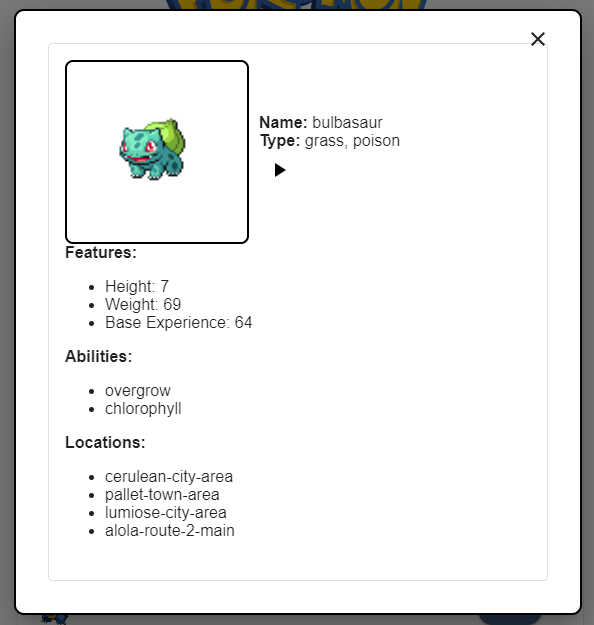

# JALASOFT POKEDEX
The following project was developed using MUI and React as main technologies. Powered by the official RESTful Pokémon API: https://pokeapi.co/ and built using Vite: https://vitejs.dev/guide/, the web application provides easy access to essential Pokémon Data in an easy-to-use interface.

### How to use
The app is fully deployed and available at: https://pokejalasoft.github.io/PokeJalasoftProject/

### Local usage
You can also locally lauch the project with the following steps:
1. Clone the repository from github: https://github.com/PokeJalasoft/PokeJalasoftProject
2. Move to the QA-NFR branch.
3. Install the dependencies: `npm i`
4. Start the project: `npm run dev`

## Features
The Jalasoft Pokedex has the following main functionalities: 

1. **View:** Pokémon themed mui card with a Pokémon datagrid:

2. **DataGrid:** The grid shows you 20 Pokémon's at a time. Each row shows you the name, type and picture of each Pokémon: 

3. **Modal:** If you click on the Show button, a modal with the information of the Pokémon pops up, showing its name, type, features, abilities and locations:

4. **Sound Button:** You can also click on the Play Button to play the Pokémon's main battle cry: 

5. **Previous/Next Buttons:** Switch between Pokémon pages (20 at the time) with the previous and next buttons on the bottom of the card:

6. **Filter and Export** You can filter only the Pokémons you want to see with Filter, and save the datagrid as a .csv with Export:

## Folder Struture:
The project was built using React + Vite and generated the following project structure:

### Root Directory:
- package.json: This file holds project metadata, dependencies, and scripts.
- node_modules: This folder stores the installed dependencies of your project. It's typically excluded from version control.
- public: This directory contains static assets like favicons or robots.txt that are directly copied to the output directory during build.

### Source Directory (src):
- components: This folder holds reusable React components.
- hooks: This folder contains the useEffect() hooks of the application.
- modals: Holds the project Modal component.
- pages: This folder contains the main page of the project.

### Other Configuration Files (optional):

- .eslintrc: This file configures ESLint, a popular linting tool that helps enforce code style and quality.
- tsconfig.json: If you're using TypeScript, this file configures the TypeScript compiler.

### Image structure

## Modules
Now we will provide a short introduction to each React + MUI component:

- Button: Simple React button customized according to the project sketch.
- PlayButton: An icon button that reproduced each pokemon sound via its url.
- PokemonDataGrid: A more complex component built using MUI-X. Employs a GridColDef property in order to load rows of Pokémon. Shows up to 20 Pokémon at a time.
- usePokemon: A React hook that loads information about an individual pokemon (including its name, type, image and other details).
- usePokemons: Uses bas urls in order to retrieve a list of 20 pokemons and its sounds.
- DetailsModal: Shows detailed information of an individual Pokémon based on the usePokemon hook.
- layout: A simple React card stilized according to the project sketch.
- Pokedex: Holds the layout along with its styles and a Pókemon background.
- main.tsx: The default main entry of the app.

## Trello
The Agile Kanban board of the project is available at: https://trello.com/b/sO52sOaZ/pokejalasoft

## Authors
- Sebastian Rosales Zurita: sebastian.rosales@jalasoft.com
- Pablo Terceros Camacho: pablo.terceros@jalasoft.com